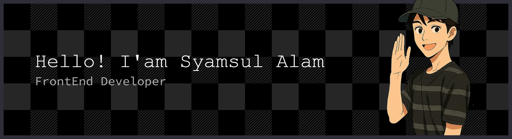

  

###

  
  
  

###

  

###

<h3 align="left">About Me</h3>

###

Hi! I'm Syamsul Alam  I'm currently busy learning coding, especially in Python, AI, and web development. I love challenges, especially when it comes to new technologies. My dream? To become an AI engineer who can create cool and useful technology for many people

###

<h3 align="left">🛠 Language and tools</h3>

###

  
  
  
  
  
  
  
  
  
  
  
  
  
  
  

###

<h3 align="left">My Stats :</h3>

###

  

###

<picture>
  <source media="(prefers-color-scheme: dark)" srcset="https://raw.githubusercontent.com/syamsulaalam/syamsulaalam/output/pacman-contribution-graph-dark.svg">
  <source media="(prefers-color-scheme: light)" srcset="https://raw.githubusercontent.com/syamsulaalam/syamsulaalam/output/pacman-contribution-graph.svg">
  
</picture>

###

<!--
**syamsulaalam/syamsulaalam** is a ✨ _special_ ✨ repository because its `README.md` (this file) appears on your GitHub profile.

Here are some ideas to get you started:

- 🔭 I’m currently working on ...
- 🌱 I’m currently learning ...
- 👯 I’m looking to collaborate on ...
- 🤔 I’m looking for help with ...
- 💬 Ask me about ...
- 📫 How to reach me: ...
- 😄 Pronouns: ...
- ⚡ Fun fact: ...
-->
